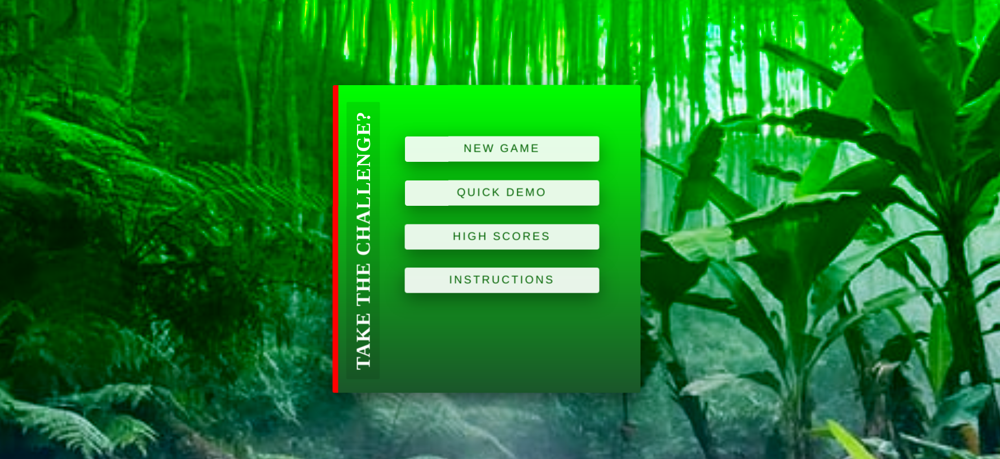
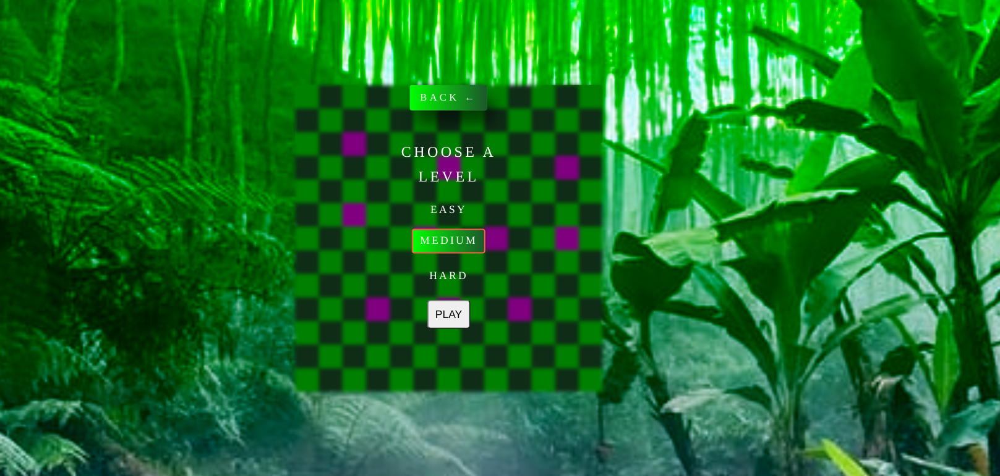
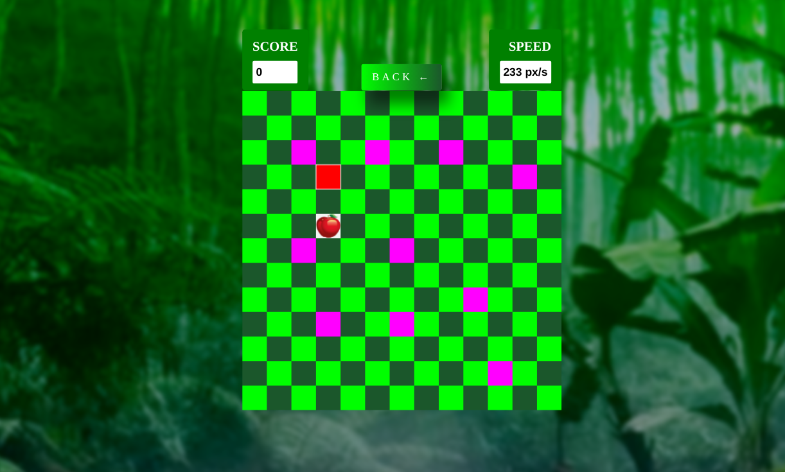
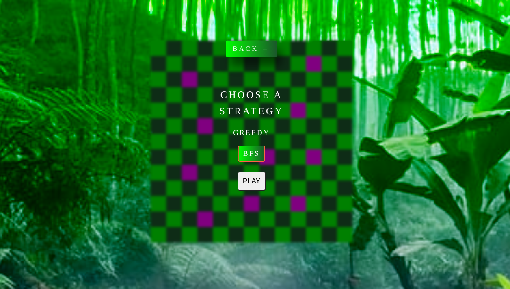

# SNAKE-GAME
#### A snake game based on HTML,CSS and Javascript. 
#### It has looks like a mobile snake game all its transitions, etc. are like a game in mobile only. 
## Main page
</img> 

## On Entering New Game
</img> 

## Game Play
### Different levels have different speed of snake
</img> 

## Strategic Demo
### Choose a strategy for the snake in the demo mode
</img> 

### In the demo mode, you can see how to play the game :). 
There are two strategies for the snake in the demo mode  
<ul>
<li>In the greedy strategy, if there is a danger in a direction, then snake will choose a suitable perpendicular direction. Otherwise, if the snake is vertically above food, and snake is moving in horizontal direction, then snake moves in a suitable vertical direction, else if not vertically above, and snake is moving in vertical direction, then choose a suitable horizontal direction </li>
<li>In the BFS search, the BFS search is done but since there is not a moving point but a body, so shifted body is also stored as danger can also be posed by snake body itself.</li> 
</ul>

#### It also has swipe gestures to make it easy to play on mobile phones .  
#### Play the game at https://shobhit10058.github.io/Snake-game/. 
#### If you save the game in your mobile through a browser and then open it, this launches like a normal game with the full screen occupied with the game. 

